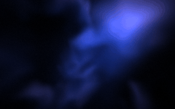
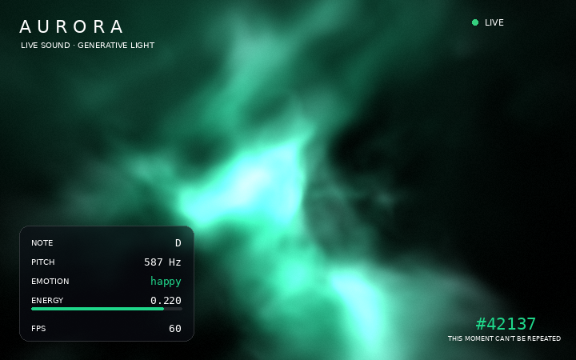
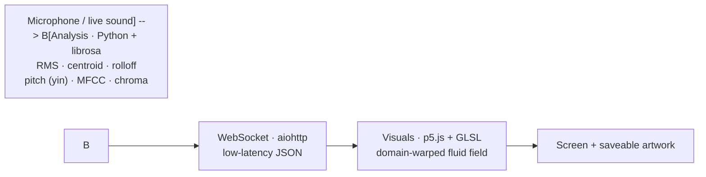
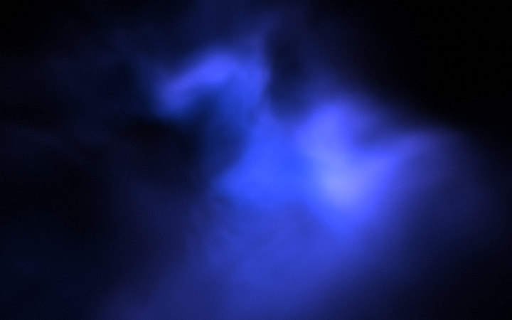
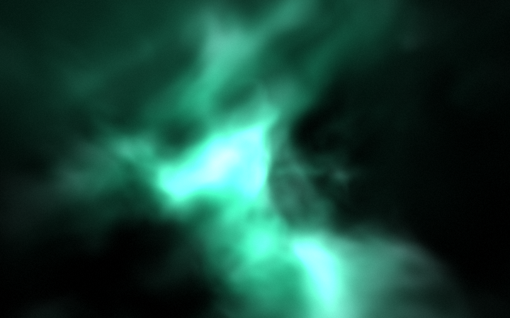
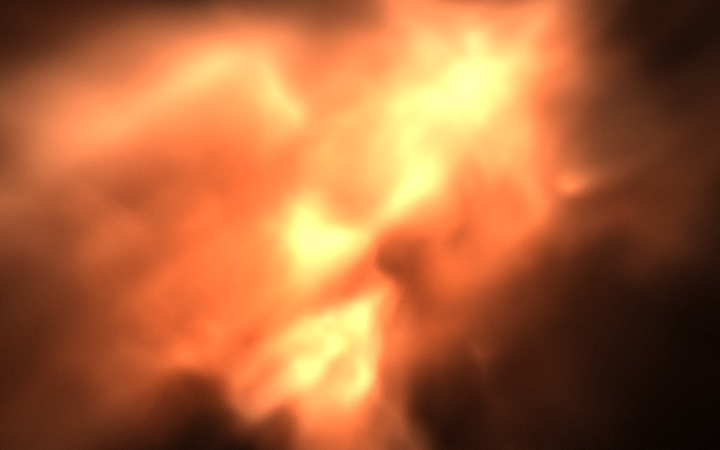
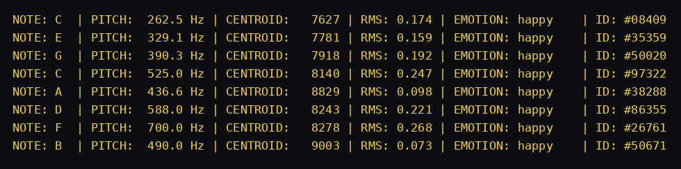

<h1 align="center">AURORA</h1>
<p align="center"><em>A real-time generative art system that turns sound into light.</em></p>
<p align="center">
  
  
  
  
  
  
</p>
<p align="center"><sub>Version 2.1 · in active development</sub></p>



*The artwork is a volumetric fluid mass floating in space — raymarched in real time, repainted 60 frames a second, shaped by the sound. Above: real render of the shader math as the camera orbits the mass while a new emotion (red) seeps through the volume into the old one (blue) — where the two palettes meet inside the fluid, they genuinely blend into violet.*



## Concept

AURORA produces a **one-time, non-repeatable visual artwork** while a pianist plays or someone speaks. Inspired by the aurora borealis and by Refik Anadol's data sculptures, it treats sound not only as rhythm but through its **pitch, timbre, loudness and emotion**, turning it into a flowing field of light.

Every session is unique — the live signal (and the **ambient noise** mixed into it) is never the same twice. The system surfaces that uniqueness as a **signature (seed)**, and you can save the frame you produce as a PNG with a single button.

## How it works

Sound passes through three stages before it reaches the browser:



The backend extracts audio features and derives an emotion label; WebSocket streams it to the browser in real time; the fragment shader maps those values to color, flow speed and brightness, repainting every frame.

## Highlights

- **Real-time DSP** — RMS, spectral centroid/rolloff, chroma (note), real pitch via `librosa.yin`, and timbre via MFCC.
- **Volumetric 3D fluid (raymarching)** — the GLSL shader marches rays through a domain-warped 3D density field with self-shadowing; a slowly orbiting camera gives real parallax and depth. Pitch drives the color accent, energy drives density, brightness and flow speed.
- **Adaptive resolution** — raymarching is fill-rate bound, so the renderer automatically scales internal resolution to hold a smooth frame rate on weaker GPUs.
- **Seeping emotion transitions** — a new emotion never snaps in: it flows through the 3D volume over ~4 s, and at the blend boundaries inside the fluid the palettes mix physically (blue + red → violet).
- **Live HUD** — shows note, pitch, emotion, energy and FPS like an instrument panel.
- **One-time signature** — a per-session `seed`; each instant gets its own moment ID.
- **Capture the performance** — "Record" saves the living artwork as a WebM video; "Save artwork" snapshots a single frame as PNG.
- **Mic-free demo** — with no microphone, a simulation kicks in so anyone who clones the repo sees it run.
- **Measured latency** — every packet carries a server timestamp; the HUD shows real pipeline latency in ms.
- **Device-independent emotion** — loudness is auto-calibrated against a running peak, so the mapping behaves the same on any microphone gain.
- **Non-blocking audio** — blocking PyAudio reads run in a worker thread; the asyncio event loop never stalls.

## Gallery

| Calm (blue) | Happy (teal) | Angry / energetic (orange) |
|:---:|:---:|:---:|
|  |  |  |

Sample analysis output (pipeline run on a synthetic piano signal):



> The preview stills are produced by running the fragment-shader math from `public/index.html` faithfully in numpy (`scripts/generate_previews.py`) — same algorithm, same result.

## Setup

```bash
git clone https://github.com/<your-username>/aurora.git
cd aurora
pip install -r requirements.txt        # core — simulation mode works out of the box
pip install -r requirements-mic.txt    # optional: real microphone (PyAudio)
python main.py
```

Then open **http://localhost:5000** in your browser.

No microphone? Skip the second install — the simulation runs automatically (or set `USE_REAL_MIC = False` in `config.py`).

## Project structure

```
aurora/
├── main.py            # aiohttp server + analysis loop + WebSocket
├── audio_engine.py    # feature extraction + emotion + unique signature
├── config.py          # single source of truth: port, audio params, feature switches
├── requirements.txt
├── public/
│   └── index.html     # p5.js + GLSL shader + HUD interface
├── tests/
│   └── test_audio_engine.py   # unit tests for the decision logic
├── .github/workflows/ci.yml   # lint (ruff) + tests (pytest) on every push
├── scripts/
│   └── generate_previews.py
└── docs/images/       # README assets
```

## Tech stack

| Layer | Technology |
|---|---|
| Analysis | Python, librosa, NumPy |
| Audio capture | PyAudio |
| Communication | aiohttp WebSocket, asyncio |
| Visuals | p5.js (WebGL), GLSL volumetric raymarching shader |

## Testing & CI

The decision logic (emotion thresholds, gain calibration, note gating, signatures) is covered by **16 unit tests** — including a hardware-independence test proving that a quiet mic and a hot mic playing the same passage produce the same normalized dynamics. GitHub Actions runs `ruff` and `pytest` on every push.

```bash
pip install -r requirements-dev.txt
pytest -v
```

## Security notes

- The server binds to **localhost only** by default; set `ALLOW_LAN = True` in `config.py` to let devices on your network watch the stream.
- WebSocket connections are **origin-checked** (cross-site hijacking guard) and capped at `MAX_CLIENTS`.

## Emotion mapping

Emotion is derived through **transparent, rule-based (heuristic)** thresholds over RMS, centroid and rolloff — it is not a trained model. This is a deliberate choice: it behaves predictably and with low latency during a live performance.

## Troubleshooting

- **No audio reaction** — check OS/browser microphone permissions; confirm PyAudio is installed (`pip install -r requirements-mic.txt`). Without a mic, simulation mode runs automatically.
- **WebSocket won't connect** — make sure the server is running on port 5000 and no firewall blocks it; check the browser console for errors.
- **Low FPS / choppy visuals** — enable GPU acceleration in your browser and disable power-saving mode. The renderer already lowers its internal resolution automatically to protect the frame rate; a smaller window helps further.

## References

- McFee, B., et al. (2015). *librosa: Audio and music signal analysis in Python.* Proc. SciPy.
- Müller, M. (2015). *Fundamentals of Music Processing.* Springer.
- Fette, I., & Melnikov, A. (2011). *The WebSocket Protocol (RFC 6455).* IETF.

## License

MIT — see [LICENSE](LICENSE).

<p align="center"><sub>Hayrunnisa Maaşoğlu · Aksaray University, Software Engineering</sub></p>
